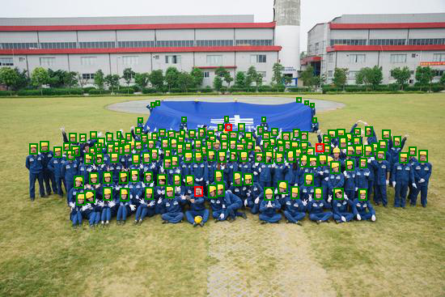
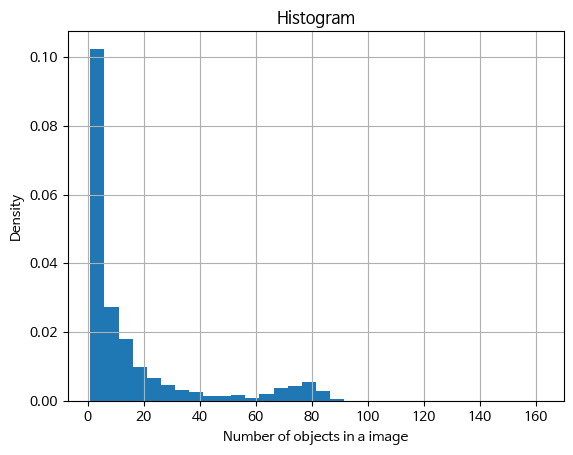
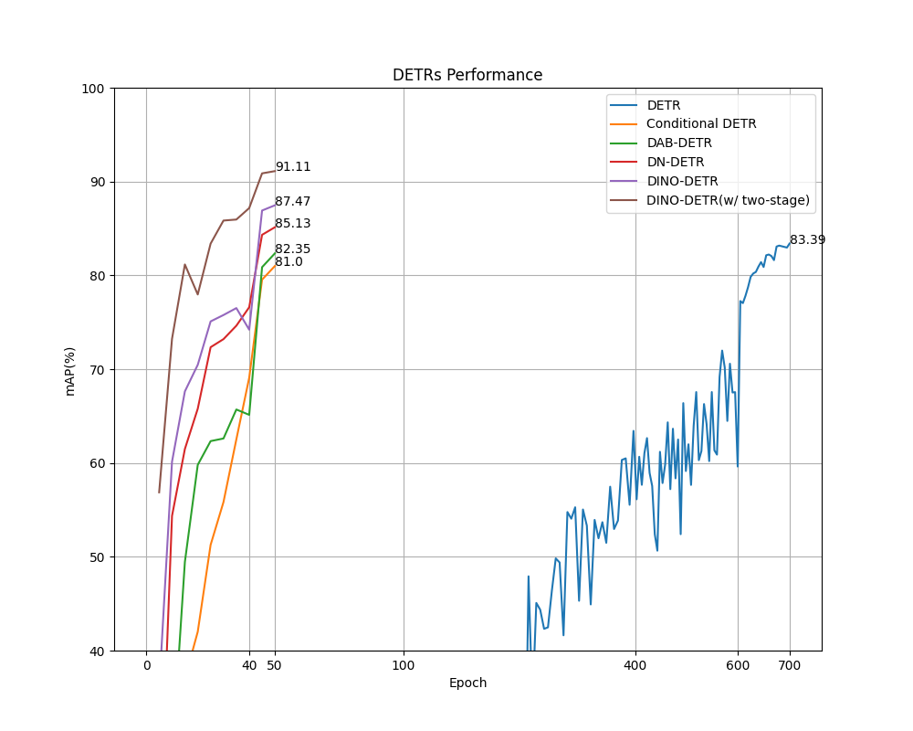

# DETRs

This repository is dedicated to studying DETR and its subsequent research. I am implementing a smaller version of the DETR model using a toy dataset. The goal is to experiment with various components from different papers by adjusting hyperparameters.

## Data: Safety-Helmet-Wearing-Dataset
NOTE: The average number of objects per image in this dataset is 16, which is higher than MS-COCO (7.7) or other datasets.

<p align="center">
  
  
  
</p>

- Download the [Safety-Helmet-Wearing-Dataset](https://github.com/njvisionpower/Safety-Helmet-Wearing-Dataset)
  - Before use the dataset, please check the [issue#1](https://github.com/tyui592/DETR/issues/1)

## Models (Currently supported features)
- DETR
  - [X] Auxiliary losses from decoder layers
- Conditional DETR
  - [X] Concatenate content and positional embeddings in the cross-attention
- DAB DETR
  - [X] Anchor query
  - [X] Modulate positional attention
  - [X] Iterative anchor update
- DN DETR
  - [X] Noised positive queries
- DNIO DETR
  - [X] A fixed number of noised queries
  - [X] Noised negative queries
  - [X] Mixed query selection
  - [ ] Look forward twice  
- Co DETR
  - [X] Auxiliary collaborative heads
      - [X] ATSS
      - [X] Faster-RCNN (loss calculation with ignore index)
  - [ ] Multi-scale adapter
  - [ ] Customized positive query

### Experimental Results
* Model performance (mAP)


## Usage
- Check the [requirements.txt](./requirements.txt).

## Scripts
Model training was conducted using a single A100 GPU (40GB). You can experiment with a GPU with less memory by reducing the batch size or image resolution.

```bash
# Model Training Scripts

gpu=0
ex='DETR'
python main.py --mode 'train' --device "cuda:${gpu}" --model 'detr' \
  --lr 0.00005 --epochs 500 --lr_milestone 400 --return_intermediate \
  --n_query 600 --decoder_ca_position_mode 'add' \
  --pin_memory --save_root "model-store/${ex}" \
  --pos_embedding 'sine' --temperature 10000 \
  --cls_match_weight 1.0 --cls_loss_weight 1.0

ex='C_DETR'
python main.py --mode 'train' --device "cuda:${gpu}" --model 'conditional_detr' \
  --epochs 50 --lr_milestone 40 --return_intermediate --n_query 600 \
  --pin_memory --save_root "model-store/${ex}" \
  --cls_loss 'focal' --pos_embedding 'sinev2' \
  --temperature 20 --query_scale_mode 'diag' 

ex='DAB-DETR'
python main.py --mode 'train' --device "cuda:${gpu}" --model 'dab-detr' \
  --epochs 50 --lr_milestone 40 --return_intermediate \
  --n_query 200 --num_pattern 3 \
  --pin_memory --save_root "model-store/${ex}" \
  --cls_loss 'focal' --pos_embedding 'sinev2' --temperature 20 \
  --modulate_wh_attn --iter_update --transformer_activation 'prelu'

ex='DN-DETR'
python main.py --mode 'train' --device "cuda:${gpu}" --model 'dn-detr' \
  --epochs 50 --lr_milestone 40 \
  --return_intermediate --n_query 600 \
  --pin_memory --save_root "model-store/${ex}" \
  --cls_loss 'focal' --pos_embedding 'sinev2' --temperature 20 \
  --modulate_wh_attn --iter_update --transformer_activation 'prelu' \
  --num_pattern 0 --num_group 5 --box_noise_scale 0.4 --label_noise_scale 0.2

ex='DINO-DETR'
python main.py --mode 'train' --device "cuda:${gpu}" --model 'dino-detr' \
  --epochs 50 --lr_milestone 40 \
  --return_intermediate --n_query 300 \
  --pin_memory --save_root "model-store/${ex}" \
  --cls_loss 'focal' --pos_embedding 'sinev2' --temperature 20 \
  --modulate_wh_attn --iter_update --transformer_activation 'prelu' \
  --num_dn_query 50 --add_neg_query --num_pattern 0 --num_group 5 \
  --box_noise_scale 0.4 --label_noise_scale 0.2 \
  --two_stage_mode 'mix' --num_encoder_query 300 --two_stage_share_head

# Model Evaluation Scripts
ex='DETR'
save_path="model-store/${ex}/test_result/"

python main.py --mode 'test' --device "cuda:${gpu}" --pin_memory --batch_size 1  \
    --eval_model_path "./model-store/${ex}/trained_model.pt" \
    --save_root ${save_path}
cd mAP/
python main.py -na -np --dr "../${save_path}"
cd ..
```

# To Do
- [ ] Deformable Attention
- [ ] Multi-scale Features
- [ ] RT-DETR

# Reference
- https://github.com/facebookresearch/detr/
- https://github.com/IDEA-Research/DAB-DETR
- https://github.com/IDEA-Research/DINO