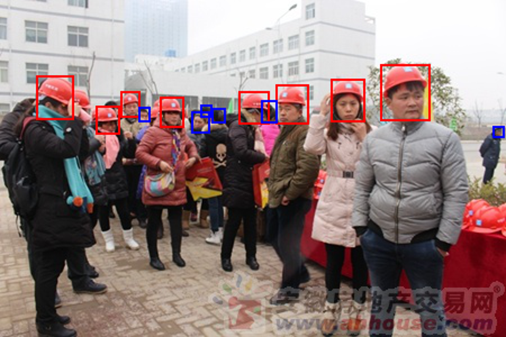
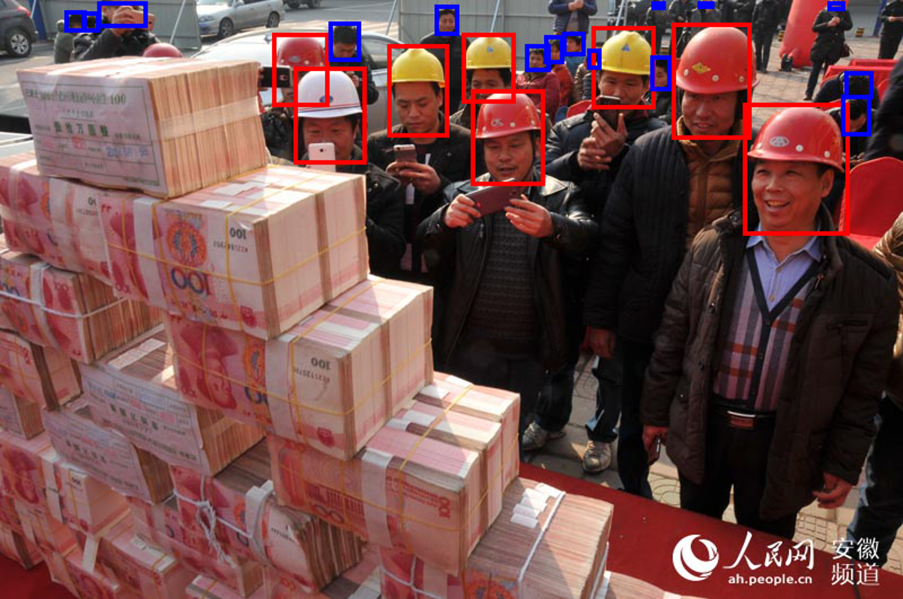
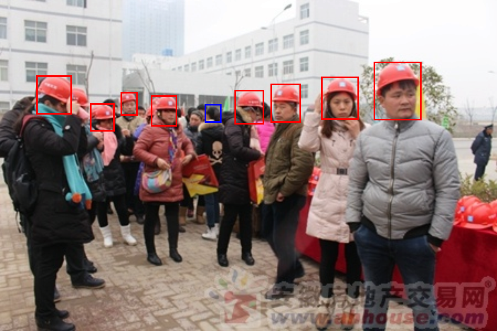
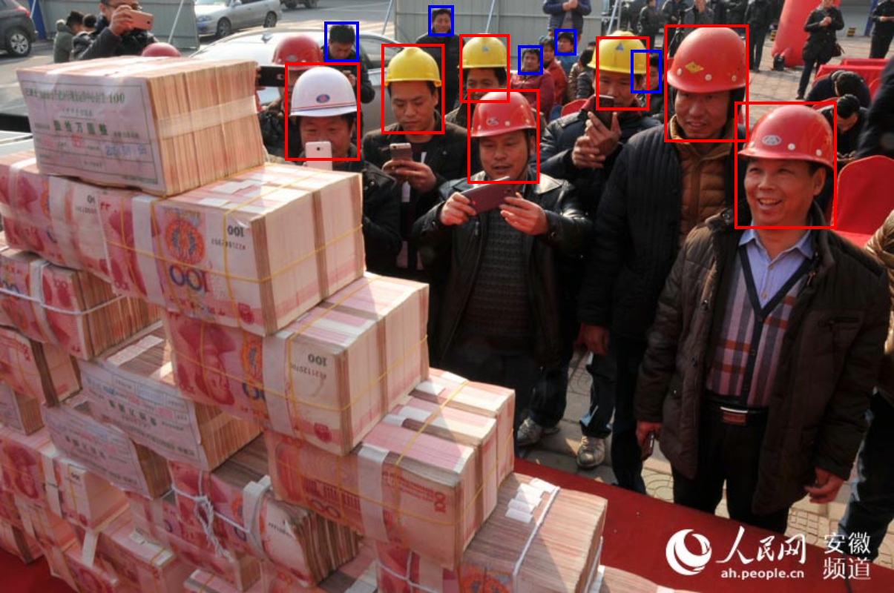
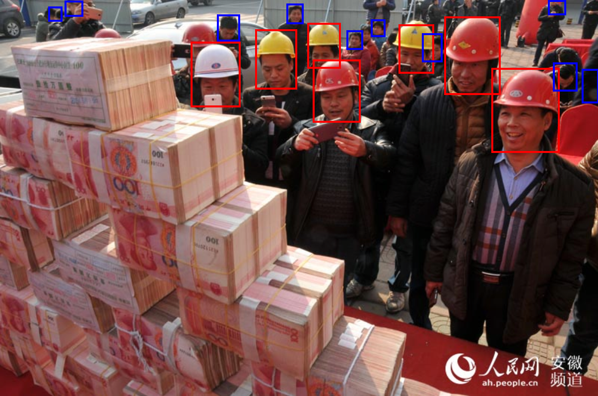
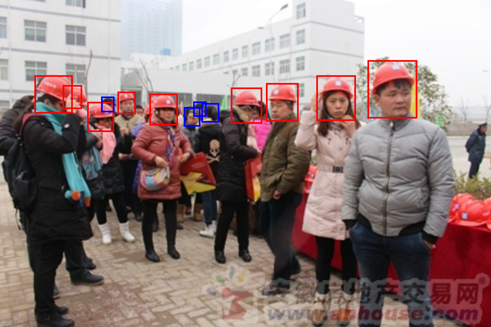
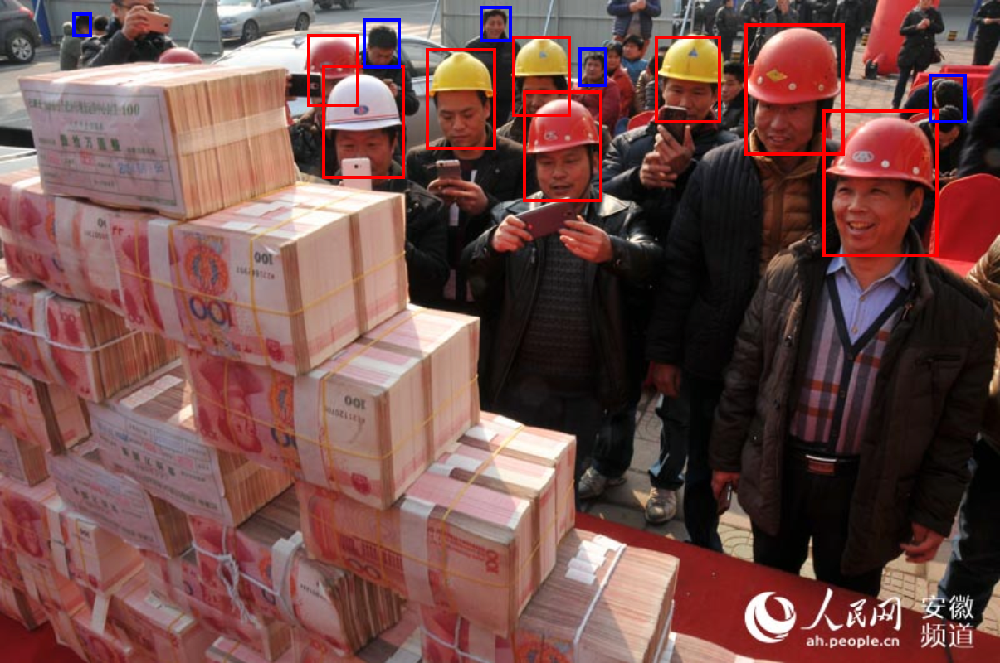
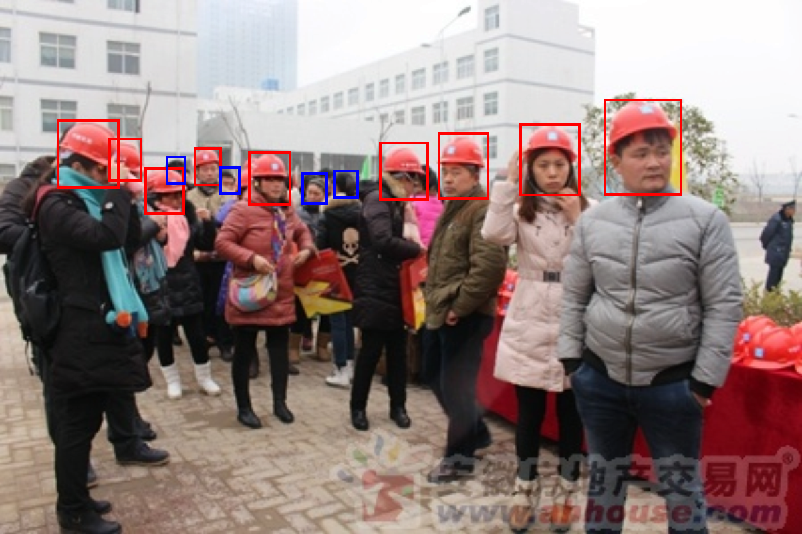
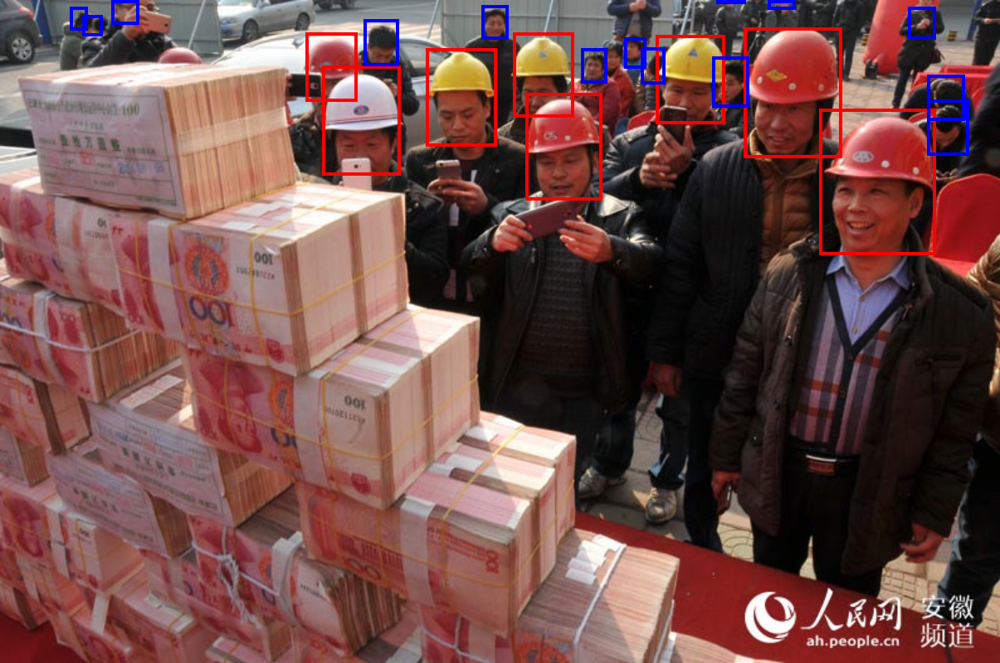

# DETRs

This repository is dedicated to studying DETR and its subsequent research. I am implementing a smaller version of the DETR model using a toy dataset. The goal is to experiment with various components from different papers by adjusting hyperparameters.

## Data: Safety-Helmet-Wearing-Dataset
NOTE: The average number of objects per image in this dataset is 16, which is higher than MS-COCO (7.7) or other datasets.

<p align="center">
  
  
  
</p>

- Download the [Safety-Helmet-Wearing-Dataset](https://github.com/njvisionpower/Safety-Helmet-Wearing-Dataset)
  - Before use the dataset, please check the [issue#1](https://github.com/tyui592/DETR/issues/1)

## Models (Currently supported features)
- DETR
- Conditional DETR
  - [X] Concatenate content and position embeddings in the cross-attention
- DAB DETR
  - [X] Anchor query
  - [X] Modulate positional attention
  - [X] Iterative anchor update
- DN DETR
  - [X] Noised positive queries
- DNIO DETR
  - [X] A fixed number of noised queries
  - [X] Noised negative queries
  - [ ] Mixed query selection (two-stage)
  - [ ] Look forward twice  

### Experimental Results
* Model performance (mAP)


* Sample Results

| Model | Output#1(w/ threshold 0.5, w/o nms)| Output#2(w/ threshold 0.5, w/o nms)| Output#2(w/ threshold 0.3, w/ nms 0.3)|
| --- | --- | -- | -- |
| GT |  |  |  | 
| DETR |  |  |   | 
| Conditional DETR |  |  |  | 
| DAB-DETR |  |  |  | 
| DN-DETR |  |  |  | 
| DINO-DETR |  |  |  |

## Usage
- Check the [requirements.txt](./requirements.txt).

## Scripts
<details>
  <summary>Model train/validation scripts</summary>

```bash
# DETR
ex=01
python main.py --mode 'train' --device "cuda:0" --model 'detr' --dataset 'shwd' \
  --lr 0.00005 --lr_backbone 0.00001 --epochs 700 --lr_milestone 600 --lr_gamma 0.1 \
  --return_intermediate --max_grad_norm 0.1 --weight_decay 0.0001 \
  --d_model 256 --d_ff 2048 --n_heads 8 --p_drop 0.0 --n_query 600 \
  --backbone "resnet50" --layer_index 7 --n_decoder_layers 6 --n_encoder_layers 6 \
  --encoder_position_mode 'add' --decoder_sa_position_mode 'add' --decoder_ca_position_mode 'add' \
  --batch_size 8 --image_set 'trainval' --aug_policy 6 \
  --num_workers 4 --pin_memory --save_root "model-store/ex${ex}" \
  --cls_loss 'ce' --pos_embedding 'sine' --temperature 10000 \
  --cls_match_weight 1.0 --l1_match_weight 5.0 --giou_match_weight 2.0 \
  --cls_loss_weight 1.0 --l1_loss_weight 5.0 --giou_loss_weight 2.0 --noobj_cls_weight 0.1 \
  --wb_flag --wb_project 'detr' --wb_name "${ex}" --wb_tags "DETR"

# Conditional DETR
ex=02
python main.py --mode 'train' --device "cuda:0" --model 'conditional_detr' --dataset 'shwd' \
  --lr 0.0001 --lr_backbone 0.00001 --epochs 50 --lr_milestone 40 --lr_gamma 0.1 \
  --return_intermediate --max_grad_norm 0.1 --weight_decay 0.0001 \
  --d_model 256 --d_ff 2048 --n_heads 8 --p_drop 0.0 --n_query 600 --num_pattern 0 \
  --backbone "resnet50" --layer_index 7 --n_decoder_layers 6 --n_encoder_layers 6 \
  --encoder_position_mode 'add' --decoder_sa_position_mode 'add' --decoder_ca_position_mode 'cat' \
  --batch_size 8 --image_set 'trainval' --aug_policy 6 \
  --num_workers 4 --pin_memory --save_root "model-store/ex${ex}" \
  --cls_loss 'focal' --pos_embedding 'sinev2' --temperature 20 --query_scale_mode 'diag' \
  --transformer_activation 'relu' \
  --cls_match_weight 2.0 --l1_match_weight 5.0 --giou_match_weight 2.0 \
  --cls_loss_weight 2.0 --l1_loss_weight 5.0 --giou_loss_weight 2.0 --noobj_cls_weight 0.1 \
  --wb_flag --wb_project 'detr' --wb_name "${ex}" --wb_tags "Conditional-DETR"

# DAB DETR
ex=03
python main.py --mode 'train' --device "cuda:0" --model 'dab-detr' --dataset 'shwd' \
  --lr 0.0001 --lr_backbone 0.00001 --epochs 50 --lr_milestone 40 --lr_gamma 0.1 \
  --return_intermediate --max_grad_norm 0.1 --weight_decay 0.0001 \
  --d_model 256 --d_ff 2048 --n_heads 8 --p_drop 0.0 --n_query 200 --num_pattern 3 \
  --backbone "resnet50" --layer_index 7 --n_decoder_layers 6 --n_encoder_layers 6 \
  --encoder_position_mode 'add' --decoder_sa_position_mode 'add' --decoder_ca_position_mode 'cat' \
  --batch_size 8 --image_set 'trainval' --aug_policy 6 \
  --num_workers 4 --pin_memory --save_root "model-store/ex${ex}" \
  --cls_loss 'focal' --pos_embedding 'sinev2' --temperature 20 --query_scale_mode 'diag' \
  --modulate_wh_attn --iter_update --transformer_activation 'prelu' \
  --cls_match_weight 2.0 --l1_match_weight 5.0 --giou_match_weight 2.0 \
  --cls_loss_weight 2.0 --l1_loss_weight 5.0 --giou_loss_weight 2.0 --noobj_cls_weight 0.1 \
  --wb_flag --wb_project 'detr' --wb_name "${ex}" --wb_tags "DAB-DETR"

# DN DETR
ex=04
python main.py --mode 'train' --device "cuda:0" --model 'dn-detr' --dataset 'shwd' \
  --lr 0.0001 --lr_backbone 0.00001 --epochs 50 --lr_milestone 40 --lr_gamma 0.1 \
  --return_intermediate --max_grad_norm 0.1 --weight_decay 0.0001 \
  --d_model 256 --d_ff 2048 --n_heads 8 --p_drop 0.0 --n_query 600 \
  --backbone "resnet50" --layer_index 7 --n_decoder_layers 6 --n_encoder_layers 6 \
  --encoder_position_mode 'add' --decoder_sa_position_mode 'add' --decoder_ca_position_mode 'cat' \
  --batch_size 8 --image_set 'trainval' --aug_policy 6 \
  --num_workers 4 --pin_memory --save_root "model-store/ex${ex}" \
  --cls_loss 'focal' --pos_embedding 'sinev2' --temperature 20 --query_scale_mode 'diag' \
  --modulate_wh_attn --iter_update --transformer_activation 'prelu' \
  --num_pattern 0 --num_group 3 --box_noise_scale 0.4 --label_noise_scale 0.2 \
  --cls_match_weight 2.0 --l1_match_weight 5.0 --giou_match_weight 2.0 \
  --cls_loss_weight 2.0 --l1_loss_weight 5.0 --giou_loss_weight 2.0 --noobj_cls_weight 0.1 \
  --wb_flag --wb_project 'detr' --wb_name "${ex}" --wb_tags "DN-DETR"

# DINO DETR
ex=05
python main.py --mode 'train' --device "cuda:0" --model 'dino-detr' --dataset 'shwd' \
  --lr 0.0001 --lr_backbone 0.00001 --epochs 50 --lr_milestone 40 --lr_gamma 0.1 \
  --return_intermediate --max_grad_norm 0.1 --weight_decay 0.0001 \
  --d_model 256 --d_ff 2048 --n_heads 8 --p_drop 0.0 --n_query 600 \
  --backbone "resnet50" --layer_index 7 --n_decoder_layers 6 --n_encoder_layers 6 \
  --encoder_position_mode 'add' --decoder_sa_position_mode 'add' --decoder_ca_position_mode 'cat' \
  --batch_size 8 --image_set 'trainval' --aug_policy 6 \
  --num_workers 4 --pin_memory --save_root "model-store/ex${ex}" \
  --cls_loss 'focal' --pos_embedding 'sinev2' --temperature 20 --query_scale_mode 'diag' \
  --modulate_wh_attn --iter_update --transformer_activation 'prelu' \
  --num_dn_query 50 --add_neg_query --num_pattern 0 --num_group 5 \
  --box_noise_scale 0.4 --label_noise_scale 0.2 \
  --cls_match_weight 2.0 --l1_match_weight 5.0 --giou_match_weight 2.0 \
  --cls_loss_weight 2.0 --l1_loss_weight 5.0 --giou_loss_weight 2.0 --noobj_cls_weight 0.1 \
  --wb_flag --wb_project 'detr' --wb_name "${ex}" --wb_tags "DINO-DETR"

# Model evaluation.
ex=01
save_path="model-store/ex${ex}/test_result/"

python main.py --mode 'test' --device 'cuda:0' --pin_memory --batch_size 1  \
    --eval_model_path "./model-store/ex${ex}/trained_model.pt" \
    --save_root ${save_path}
cd mAP/
python main.py -na -np --dr "../${save_path}"
cd ..
```
</details>

# To Do
- [ ] Deformable Attention
- [ ] (DINO) (Two-stage) mixed query selection.

# Reference
- https://github.com/facebookresearch/detr/
- https://github.com/IDEA-Research/DAB-DETR
- https://github.com/IDEA-Research/DINO